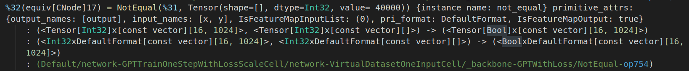

# ir README

This is the README for the extension "IRColor". Used for highlight some symbols of the IR files.

## Features

1. Highlight the operator, scope name, shape and some key variables of the IR files. See below:

2. Support name jumping like followings

## Requirements

No requirements

## Extension Settings

None

## Known Issues

Calling out known issues can help limit users opening duplicate issues against your extension.

## Release Notes

Users appreciate release notes as you update your extension.

### 0.0.2

1. Support name jumping. Currently the parameters and the number.

### 0.0.1

1. Beta version with only key highlight features. More features are coming

**Enjoy!**
